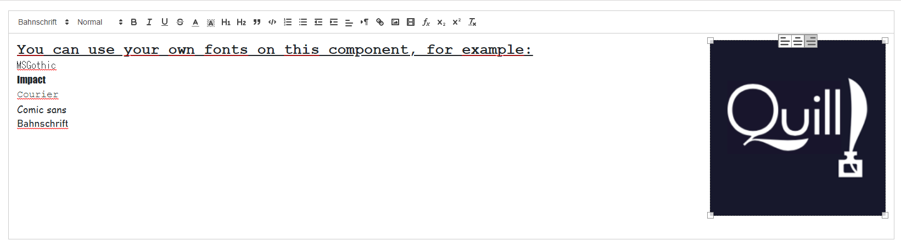

# Penman.Blazor.Quill TextEditor
Penman.Blazor.Quill Rich Text Editor for Blazor applications - Uses [Quill JS](https://quilljs.com/ "Quill JS.com")




### Installing

You can install from NuGet using the following command:

`Install-Package Penman.Blazor.Quill`

Or via the Visual Studio package manger.

### Setup
Add the following CSS files to `_Host.cshtml` if you're using Blazor Server or to `index.html` if you're using Blazor WebAssembly

```html
    <link href="//cdn.quilljs.com/1.3.6/quill.snow.css" rel="stylesheet">
    <link href="//cdn.quilljs.com/1.3.6/quill.bubble.css" rel="stylesheet">
```
And then do the same with the Javascript files

```html
    <script src="https://cdn.quilljs.com/1.3.6/quill.js"></script>
    <script src="_content/Penman.Blazor.Quill/quill-blot-formatter.min.js"></script>
    <script src="_content/Penman.Blazor.Quill/BlazorQuill.js"></script>
```

Add the following using statement to `_Imports.razor`.

```cs
@using Penman.Blazor.Quill
```

## Usage

### Basic Example
Compared to the original project, this fork implements a much simpler way to use the component.

```cs
@using Penman.Blazor.Quill
<TextEditor Toolbar="new Toolbar { ShowFullToolbar=true }" EditorContainerId="TestId" @ref="@MyEditor"
                    Placeholder="Enter non HTML format like centering...">
</TextEditor>
@code { 
	TextEditor MyEditor;
}

```

However, should you wish to for some reason, you can still use the component in the old, more verbose way.

```cs
@using Penman.Blazor.Quill

<TextEditor @ref="@QuillHtml">
    <ToolbarContent>
        <select class="ql-header">
            <option selected=""></option>
            <option value="1"></option>
            <option value="2"></option>
            <option value="3"></option>
            <option value="4"></option>
            <option value="5"></option>
        </select>
        <span class="ql-formats">
            <button class="ql-bold"></button>
            <button class="ql-italic"></button>
            <button class="ql-underline"></button>
            <button class="ql-strike"></button>
        </span>
        <span class="ql-formats">
            <select class="ql-color"></select>
            <select class="ql-background"></select>
        </span>
        <span class="ql-formats">
            <button class="ql-list" value="ordered"></button>
            <button class="ql-list" value="bullet"></button>
        </span>
        <span class="ql-formats">
            <button class="ql-link"></button>
        </span>
    </ToolbarContent>
    <EditorContent>
        <h4>This Toolbar works with HTML</h4>
        <a href="http://BlazorHelpWebsite.com">
        BlazorHelpWebsite.com</a>
    </EditorContent>
</TextEditor>
<br />
<button class="btn btn-primary" 
        @onclick="GetHTML">Get HTML</button>
<button class="btn btn-primary"
        @onclick="SetHTML">Set HTML</button>
<br />
<div>
    <br />
    @((MarkupString)QuillHTMLContent)
    @QuillHTMLContent
</div>
<br />

@code {

TextEditor QuillHtml;
string QuillHTMLContent;

    public async void GetHTML()
    {
        QuillHTMLContent = await this.QuillHtml.GetHTML();
        StateHasChanged();
    }

    public async void SetHTML()
    {
        string QuillContent =
            @"<a href='http://BlazorHelpWebsite.com/'>" +
            "</a>";

        await this.QuillHtml.LoadHTMLContent(QuillContent);
        StateHasChanged();
    }
}
```

### Add fonts
This fork also implements a simple way to add your own fonts to the editor.

```cs
@using Penman.Blazor.Quill

<style>
    /*SET THE DEFAULT FONT*/
    #TestId {
        font-family: "MS Gothic";
        font-size: 18px;
        height: 375px;
    }

    /*DEFINE ALL OF THE CUSTOM FONTS*/
    .ql-font-MSGothic {
        font-family: 'MS Gothic';
    }

    .ql-font-Bahnschrift {
        font-family: 'Bahnschrift'
    }

    .ql-font-Impact {
        font-family: 'Impact';
    }

    .ql-font-Courier {
        font-family: 'Courier';
    }

    .ql-font-Comic {
        font-family: 'Comic Sans MS';
    }
</style>

<TextEditor Toolbar="new Toolbar { ShowFullToolbar=true }" EditorContainerId="TestId" @ref="@MyEditor" Fonts="Fonts"
            Placeholder="Enter non HTML format like centering...">
</TextEditor>

@code{
    List<string> Fonts = new List<string> { "MSGothic", "Impact", "Courier", "Comic", "Bahnschrift" }; //be sure to set the default font as the first in the list
    TextEditor MyEditor;
}

```
## Advanced functionality

### Following Toolbar

On longer documents, it becomes tedious and unusable to have the toolbar lodged up the top, so instead you can configure the snow editor to have the toolbar follow along as you edit

```

```

### Import/Export in docx
Coming soon
